# How to create custom pattern
## 1. Download and fine-tune a BERT model.  
   In my example I will be using a BERT-base model from TFHub. I have downloaded and fine-tuned the model using the [run_classifier.py](../tests/tf2_ops_accuracy/run_classifier.py) script from our repository. After this step you should have a fine-tuned BERT model in saved or frozen format.  
   
## 2. Find a BERT graph and collect the function name it is in.  
   Open this model in Netron or any other neural network viewer. Now we have to find the BERT graph inside this model. In my case I can't find it in the first graph that pops out. Therefore, I'm looking for nodes that have an "f" attribute. Examples of these nodes are PartitionedCall, StatfulPartitionedCall, RemoteCall or any other with `call` suffix. On CPU-based models, the BERT graph will most likely be inside a function called by a StatefulPartitionedCall node. Clicking on the value of attribute `f` allows me to go inside the function.  
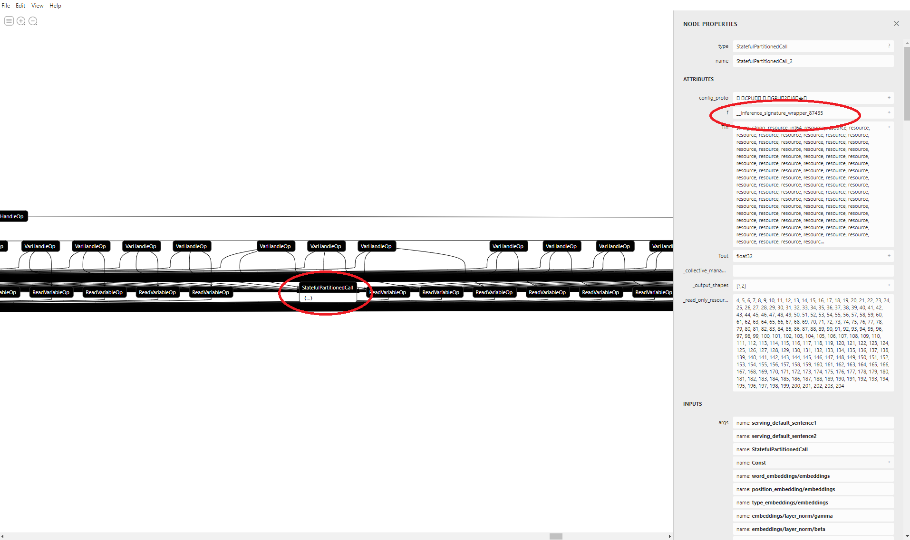  
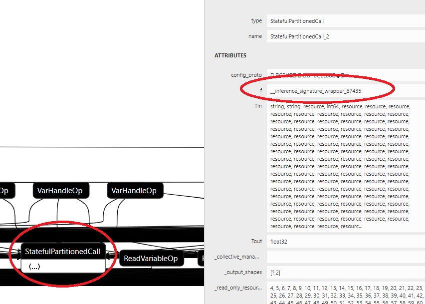  
By using this method and checking a few more functions deep I was able to find a BERT graph. A fragment of this graph is below:  
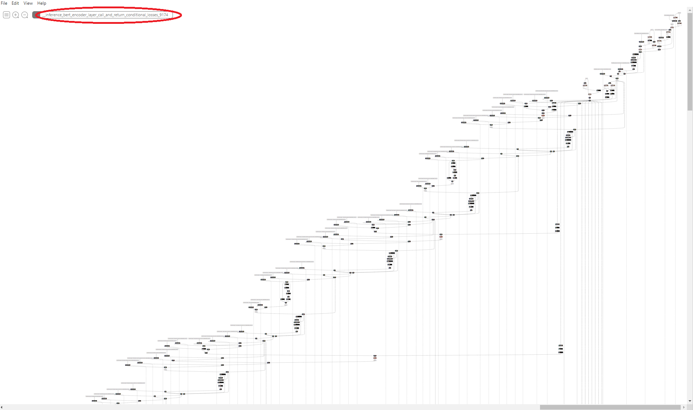  
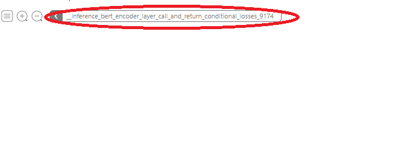  
We now collect the name of the function which in my case is:  
`__inference_bert_encoder_layer_call_and_return_conditional_losses_9174`  
In general, the function should contain the word "inference". A slightly different BERT pattern may also be present in a function used e.g. for training, but it will most likely not work with the BertOp.  
## 3. Collect names of root and input nodes.  
   In this step we will go through the BERT graph to find input and output nodes (called 'barrier' and 'root' nodes respectively in the `model_modifier`). This step should "catch" all the model weights, biases and normalization factors, as well as additional values which we will not be used, but they denote the boundary of the BERT pattern.  
   Let's start with the root node. This should be the last sum operation in the last layer (12th layer for BERT-base). Even through node names are arbitrary, it is likely that this node will have 'layer_11' or similar in its name (layers are 0-indexed). The name may also include the words 'output', 'norm' or 'normalization', as the node takes part in normalizing the layer output.  
In my case it looks like that:  
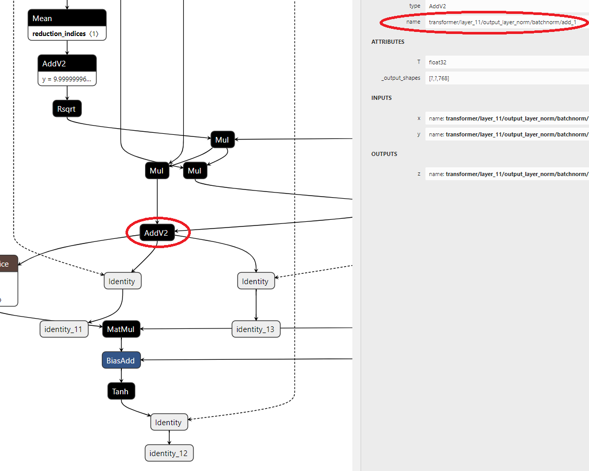  
We collect name of that node in my case:  
`transformer/layer_11/output_layer_norm/batchnorm/add_1`  
Next, we have to find barrier nodes. The `PatternExtractor` algorithm will start at the root nodes (in this case we only have one), then trace their inputs recursively going "up" the graph and stopping at the barrier nodes. The barrier nodes will include the embeddings and mask tensors, as well as model weights, biases etc.  
First, the embedding node. It is the one where all embedding tensors come together. It is also the node that feeds into the query/key/value matmuls in layer_0.  
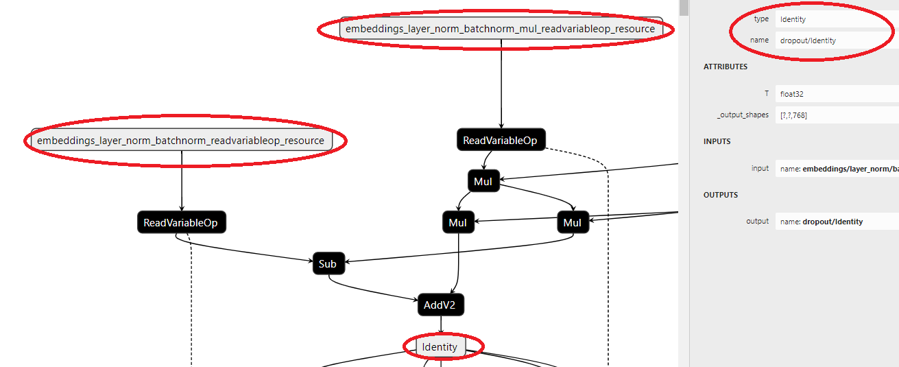  
We collect name of that node, in my case:  
`dropout/Identity`  
Now the input mask. We need to locate the node that has the same number of outputs as the number of BERT layers. Each output of the node connects to one layer. Most of the time this node will be our Mask node but sometimes there are scaling and offset operations ('mul' and 'add'/'sub' operations) applied to the input mask. Usually, they change the mask value range from {0, -1} to {-10000, 0}. Since we also apply this scaling inside our BERT operator, those operations are redundant, therefore in such cases we would pick the node just before scaling/offset nodes.  
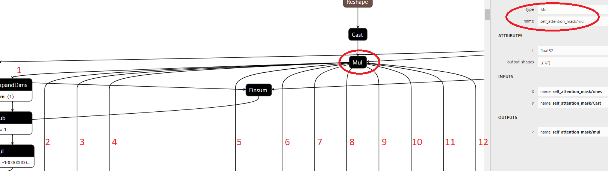  
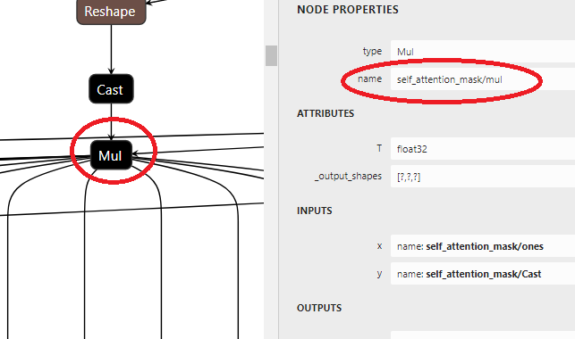  
We collect name of the mask:  
`self_attention_mask/mul`  
Last thing to do is to add barrier nodes for weights, biases etc. Since there are over a houndred of these, we will selecet these barrier nodes by operation type rather than by name. In order to find out on what type of nodes we should stop, we need to check the graph and look for inputs of `Add` and `Mul` nodes (i.e. locate where the weights come from). In my case, as we can see in the screenshot, `ReadVariableOp` is used to input the weights everywhere and `Const` is used in a few places (Netron does not draw `Const` nodes but it's visible as an input of the `Mul` node, highlighted with blue circle).  
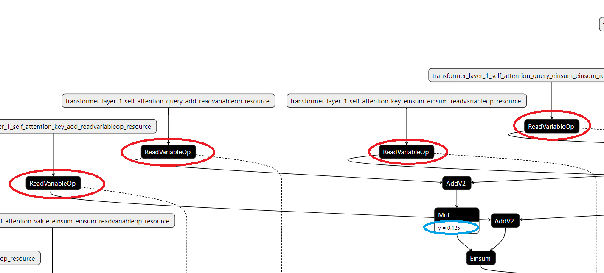  
I'm adding the following barrier ops:  
* ReadVariableOp  
* Const  

This way, the algorithm will stop at any node of `ReadVariableOp` or `Const` type. This will include all the weight/bias/normalization nodes, as well as bunch of other nodes we don't need (we will deal with them later).  
## 4. Extract the BERT pattern from the model.  
After all that we can run a script that will extract the BERT pattern from this graph.  
```sh
 python -m extract_pattern.py $bert_model -o $extracted_bert_pattern \
 -s \
   transformer/layer_11/output_layer_norm/batchnorm/add_1 \
 -b \
   dropout/Identity \
   self_attention_mask/mul \
 -B \
   ReadVariableOp \
   Const \
 -m 0 \
 -f \
   __inference_bert_encoder_layer_call_and_return_conditional_losses_9174
```
The result of this script should be a file with the BERT pattern extracted from the model.  
## 5. Create the NodeDef file from the extracted pattern.  
   The "inputs" in the pattern are simply all the encountered barrier nodes, so they include the mask, embeddings and all the weights/biases we need. We will reuse these to create the list of inputs for our BertOp node. From the extracted pattern we have to copy and paste first the two inputs containing embeddings and the mask, as well as all inputs of the first layer (layer_0). We put those in a NodeDef file (name it anything, like 'node_def.pbtxt'). Delete the "s" letter from the word "inputs" in all lines of the NodeDef file. This is because the list of inputs in TensorFlow's NodeDef Proto is called "input" (singular). Now we have to pick 18 nodes fromt that list that we have (mask, embedding and 16 weights/biases). The rest we can delete. After that, we must sort them in the order in which they are passed to our operator.  
   > Note: Correct order of inputs: Query, Key, Value, Attention, Gamma1, Beta1 Intermediate, Output, Gamma2, Beta2

  Add `name: "fused_bert"` and `op: "Bert"` attributes at the beginning of the file. See image below:  
   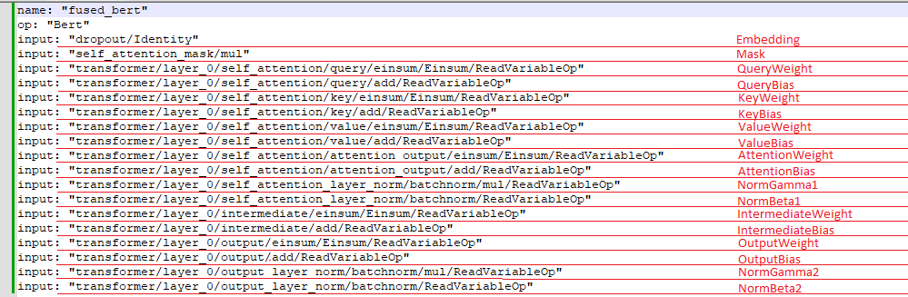  
   When your node def file looks like mine above, copy and paste all the inputs (except Name, Op, Embedding and Mask) inside this file to have 12 layers (indexed from 0 to 11) for BERT base model, only changing the layer index.  
   > Note: It may also be necessary with some models to change additional indices present in the input names. Compare the layer_0 and layer_1 nodes of the pattern file to see if there are any nodes with indices incrementing independently of the layer number.  
   
   This generally much quicker than manually copying all the required inputs from the pattern protobuf. At the end there should be 194 inputs in the NodeDef file (embedding and mask + 16 inputs per layer, so 2 + 16 * 12 = 194).  
   > Note: that in BERT large which has 24 layers number of inputs will be 386 (embedding and mask + 16 inputs per layer, so 2 + 16 * 24 = 386).  
   
   Last thing to add to this file are the attributes. Below is a mostly pre-configured BERT-base setup, which you can paste at the end of the NodeDef file.  
   ```python
   attr {
     key: "HiddenAct"
     value {
       s: "gelu_tanh"
     }
   }
   attr {
     key: "HiddenSize"
     value {
       i: 768
     }
   }
   attr { 
     key: "IntermediateSize"
     value {
       i: 3072
     }
   }
   attr {
      key: "MaskT"
      value {
        type: DT_FLOAT
      }
   }
   attr {
     key: "NumAttentionHeads"
     value {
       i: 12
     }
   }
   attr {
     key: "NumWeights"
     value {
       i: 192
     }
   }
   attr {
     key: "_output_shapes"
     value {
       list {
         shape {
           unknown_rank: true
         }
       }
     }
   }
   ```
 
   This is a default config for the BERT-base model, but it may be necessary to change the value of `MaskT`. Some base models have a different mask type than `DT_FLOAT`, please check the output type of the Mask node and change it accordingly:  
   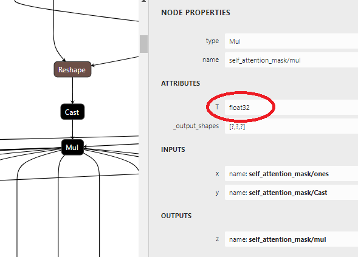  
   After this step your NodeDef file is complete. We will set the values of remaining attributes later. Example of the finished NodeDef could be seen here [TF2 TFHub BERT-Base example](tf2-tfhub/bert_en_uncased_L-12_H-768_A-12_4/fused_bert_node_def.pbtxt)  
   > Note: That the values of those attributes (hidden size etc.) will vary if you try to modify a BERT-large model.  
## 6. Create the recipe file.  
   In order to the create recipe file, we have to run `make_recipe.py` with the command below:  
   ```sh
   python make_recipe.py \
     $extracted_bert_pattern \
     $node_def \
     $recipe
   ```  
   The recipe file simply bundles the pattern and the NodeDef together.  
## 7. Modify the model.  
   Now, we can put all the pieces together and modify the model. To do that, use the command below:
   ```sh
   python replace_pattern.py $bert_model \
     -r $recipe \
     -o $bert_model/modified_saved_model.pb
   ```  
   This will use the recipe file to locate any occurences of the BERT pattern in the model graph, replace them with the BertOp, then save a copy of the modified model protobuf into `modified_saved_model.pb`. You can then easily switch between modified and original model graphs, e.g.:  
   ```bash
   $ mv saved_model.pb original_saved_model.pb # preserve the original model graph  
   $ ln -s modified_saved_model.pb saved_model.pb # symlink the modified model graph into place
   ```
## 8. Configure modified model.  
   Last thing to do before running your workload with the modified model is to configure any remaining attributes. In order to do this, use the `configure_bert_op.py` tool with parameters below:  
   ```sh
   --quantization or -q - turns on quantization support
   --no-quantization or -Q - turns off quantization support
   --bfloat16 or -b - turns on bfloat16 support 
   --no-bfloat16 or -B - turns off bfloat16 support
   --max-seq-len or -s - set the max sequence length of the model (usually 128 for BERT-base)
   ```
   Those are just a few parameters, for more please check file [configure_bert_op.py](../python/model_modifier/configure_bert_op.py).  
   
   ```sh
   # Example FP32 setup, no quantization, no bfloat16 support, max sequence length of 128
   python configure_bert_op.py modified_model.pb -Q -B -s 128
   ```
  > Note: We only need to set the values for the attributes we skipped in the NodeDef file in step 5. We could have set their initial values in the NodeDef as well and skipped this configuration step altogether. The configuration script could still be useful later, e.g. to change quantization or bfloat16 settings.